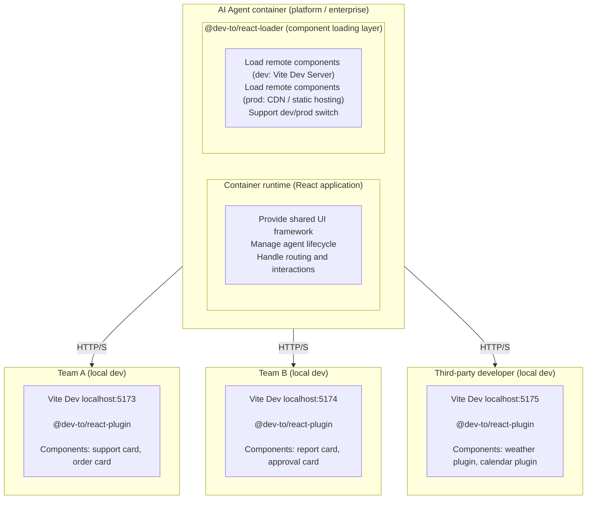

# Ɖev-to

English | [Chinese](./README_zh.md)

A React component toolchain for AI agent platforms and agent containers. It gives third-party developers a local-like experience while the host container hot-reloads components in real time.

> Quick start: `npm create dev-to` - create your first project in ~30 seconds.

## Why dev-to?

As AI agent platforms grow, enterprises often need an agent container that allows:
- Internal teams to build their own agent cards.
- External developers to ship plugin components.
- Multi-team collaboration with independent ownership and deployment.

Common pain points with traditional integration:
1. Host environment is a black box: components must be deployed into the container to debug.
2. Slow feedback loops: rebuild and redeploy for every change.
3. Production debugging is hard: limited visibility into runtime behavior.
4. Asset path issues: images and fonts 404 in the container.
5. Runtime conflicts: multiple React instances lead to hooks errors.

dev-to solves this by:
- Keeping container details hidden while keeping component logic transparent.
- Enabling cross-environment HMR with Vite Dev Server.
- Standardizing discovery and runtime protocols between host and components.

## Key features

- Cross-environment HMR between Vite and the host container.
- Local-like debugging in production (opt-in).
- Standard discovery endpoint and bridge contracts.
- Built-in debug panel and UMD packaging.
- Shared React runtime to avoid multi-instance conflicts.

## Comparison with alternatives

### Overview

| Solution | Core focus | Maturity |
|----------|-----------|----------|
| **Module Federation** | Build-time module sharing (Webpack/Vite native) | Production-ready |
| **qiankun** | Runtime application isolation (micro-frontend) | Production-ready |
| **micro-app** | WebComponent-like micro-frontend | Production-ready |
| **single-spa** | Micro-frontend routing orchestration | Production-ready |
| **dev-to** | Cross-environment component HMR | Early stage |

### Feature comparison

| Feature | Module Federation | qiankun | micro-app | single-spa | dev-to |
|---------|-------------------|---------|-----------|------------|--------|
| **Runtime module sharing** | Native | Config required | Config required | Config required | Native |
| **Cross-app HMR** | Partial | No | No | No | Core feature |
| **JS sandbox** | No | Proxy sandbox | iframe/Proxy | No | No |
| **CSS isolation** | No | Shadow DOM/Scoped | Shadow DOM | No | CSS Modules |
| **Route management** | No | Yes | Yes | Core feature | No |
| **Preloading** | Yes | Yes | Yes | Yes | No |
| **Multi-framework** | Yes | Yes | Yes | Yes | React only |
| **TypeScript type sharing** | Plugin required | No | No | No | Native |

### Developer experience

| Metric | Module Federation | qiankun | dev-to |
|--------|-------------------|---------|--------|
| **Initial setup time** | 30-60 min | 15-30 min | ~5 min |
| **Cross-app HMR** | Host refresh needed | Full refresh needed | Real-time hot reload |
| **Debug tools** | None built-in | None built-in | Built-in debug panel |
| **Type hints** | Requires @mf-types | None | Native support |

### When to use what

```
Need cross-environment HMR during development?
├── Yes → dev-to (only native solution currently)
└── No ↓

Need JS/CSS sandbox isolation?
├── Yes → qiankun / micro-app
└── No ↓

Need module-level sharing (not app-level)?
├── Yes → Module Federation
└── No ↓

Need multi-framework support?
├── Yes → single-spa + framework adapters
└── No → Evaluate specific requirements
```

### Summary

| Solution | Best for |
|----------|----------|
| **Module Federation** | Large-scale component/module sharing across apps |
| **qiankun** | Enterprise micro-frontend with team isolation |
| **micro-app** | Quick integration with legacy systems |
| **single-spa** | Multi-framework progressive migration |
| **dev-to** | AI agent plugin platforms, best-in-class DX for component hot-reload |

**dev-to's unique value:** It is currently the only solution focused on "real-time HMR inside a host container". If your core pain point is "third-party developers code locally while the host environment previews in real-time", dev-to is the most direct choice. However, if you need sandbox isolation, route management, or other enterprise features, consider qiankun or Module Federation.

## Packages

| Package | Version | Description |
| --- | --- | --- |
| [create-dev-to](./packages/create-dev-to) | [](https://www.npmjs.com/package/create-dev-to) | Scaffold tool to create dev-to projects (multi-framework). |
| [@dev-to/react-plugin](./packages/react-plugin) | [](https://www.npmjs.com/package/@dev-to/react-plugin) | Vite-side plugin to expose bridge endpoints. |
| [@dev-to/react-loader](./packages/react-loader) | [](https://www.npmjs.com/package/@dev-to/react-loader) | Host-side loader that mounts remote React components. |
| [@dev-to/react-shared](./packages/react-shared) | [](https://www.npmjs.com/package/@dev-to/react-shared) | Shared protocol, constants, and types. |
| @dev-to/react-template | - | Example component provider (private). |
| @dev-to/react-playground | - | Example host app (private). |

## Architecture

### Typical scenario: AI agent platform + external developers



### Package dependency graph

```
@dev-to/react-shared (base protocol)
  +-- @dev-to/react-plugin (Vite side)
  |   +-- @dev-to/react-template (example)
  +-- @dev-to/react-loader (host side)
      +-- @dev-to/react-playground (example)

create-dev-to (standalone scaffold)
```

### Workflow

Component developer:
1. Create a component project with the scaffold.
2. Develop in Vite Dev Server (for example, localhost:5173).
3. Share the origin and component names with the container team.
4. The container loads the component via @dev-to/react-loader.
5. Code changes hot-reload inside the container.
6. Build UMD bundles and deploy to CDN for production.

Container team:
1. Integrate @dev-to/react-loader.
2. Configure which components to load.
3. Load local Vite origins in dev.
4. Load CDN-hosted UMD bundles in production.
5. Onboard new components without touching container code.

### Core protocol

Unified discovery endpoint: `/__dev_to__/discovery.json` (v2+)

```json5
{
  framework: {
    type: 'react',
    version: '18.2.0'
  },
  server: {
    host: 'localhost',
    port: 5173,
    protocol: 'http',
    origins: ['http://localhost:5173', 'http://127.0.0.1:5173', 'http://192.168.x.x:5173']
  },
  endpoints: {
    discovery: '/__dev_to__/discovery.json',
    contract: '/__dev_to__/react/contract.js',
    init: '/__dev_to__/react/init.js',
    runtime: '/__dev_to__/react/runtime.js',
    debug: {
      html: '/__dev_to__/debug.html',
      json: '/__dev_to__/debug.json'
    },
    loader: {
      base: '/__dev_to__/react/loader',
      umd: '/__dev_to__/react/loader.js'
    }
  },
  components: {
    'MyCard': {
      name: 'MyCard',
      entry: 'src/components/MyCard.tsx',
      framework: 'react'
    }
  },
  events: {
    fullReload: 'dev_to:react:full-reload',
    hmrUpdate: 'dev_to:react:hmr-update'
  },
  protocol: {
    version: '2.0.0',
    apiLevel: 1
  }
}
```

Legacy bridge contract (for compatibility): `/__dev_to__/react/contract.js`

```json5
{
  paths: {
    contract: '/__dev_to__/react/contract.js',
    initClient: '/__dev_to__/react/init.js',
    reactRuntime: '/__dev_to__/react/runtime.js'
  },
  events: {
    fullReload: 'dev_to:react:full-reload',
    hmrUpdate: 'dev_to:react:hmr-update'
  },
  dev: {
    componentMap: {
      'MyCard': 'src/components/MyCard.tsx'
    }
  }
}
```

## Quick start

### Option 1: Scaffold a project (recommended)

```bash
npm create dev-to
# or pnpm create dev-to
# or yarn create dev-to
# or bun create dev-to
```

Scaffold highlights:
- Choose framework (React supported now; Vue/Svelte/Solid planned).
- Choose package manager (pnpm/npm/yarn/bun).
- Choose React template (TypeScript/JavaScript, SWC support).
- Optional Rolldown experiments.

### Option 2: Manual integration

#### Step 1: Install the plugin (component provider)

```bash
npm install -D @dev-to/react-plugin
```

Configure Vite:

```ts
import { defineConfig } from 'vite'
import react from '@vitejs/plugin-react'
import { devToReactPlugin } from '@dev-to/react-plugin'

export default defineConfig({
  server: {
    port: 5173,
    cors: true,
  },
  plugins: [
    react(),
    devToReactPlugin({
      MyCard: 'src/components/MyCard.tsx',
      MyHeader: 'src/components/Header.tsx',
    }),
  ],
})
```

#### Step 2: Install the loader (host app)

```bash
npm install @dev-to/react-loader
```

Use the loader in the host app:

```tsx
import { ReactLoader } from '@dev-to/react-loader'

function App() {
  return (
    <div>
      <h1>Host application</h1>
      <ReactLoader
        origin="http://localhost:5173"
        name="MyCard"
        componentProps={{ title: 'Title', count: 42 }}
      />
    </div>
  )
}
```

#### Step 3: Run both apps

```bash
# Terminal 1
cd component-provider
npm run dev

# Terminal 2
cd host-app
npm run dev
```

## Usage

### Component map configuration

```ts
// A) wildcard mode (debug)
devToReactPlugin()

// B) string shorthand
devToReactPlugin('MyCard')

// C) object map (recommended, required in prod)
devToReactPlugin({
  MyCard: 'src/components/MyCard.tsx',
  MyHeader: 'src/components/Header.tsx',
})
```

### ReactLoader usage

```tsx
// Option 1: origin + name (recommended)
<ReactLoader
  origin="http://localhost:5173"
  name="MyCard"
  componentProps={{ title: 'Title' }}
/>

// Option 2: direct URL
<ReactLoader
  url="http://localhost:5173/@fs/path/to/MyCard.tsx"
  componentProps={{ title: 'Title' }}
/>
```

### Debug panel

```
http://localhost:5173/__dev_to__/debug.html
```

Discovery JSON:

```
http://localhost:5173/__dev_to__/discovery.json
```

## Production build (library mode)

```bash
dev-to build
# or: vite build --mode lib
```

If you used `create-dev-to`, the scaffold includes a `build:lib` script (it runs `dev-to build`):

```bash
pnpm build:lib
```

You can forward any Vite build flags, for example:

```bash
dev-to build --sourcemap --outDir dist-lib
```

Output example:

```
dist/
  MyCard/
    MyCard.js
    MyCard.css
    MyCard.d.ts
```

UMD bundles can be used anywhere:

```html
<script src="https://cdn.example.com/react.js"></script>
<script src="https://cdn.example.com/react-dom.js"></script>
<script src="/dist/MyCard/MyCard.js"></script>
<script>
  const { MyCard } = window.MyCard
</script>
```

## Advanced configuration

### Plugin options

```js
devToReactPlugin(componentMap, {
  open: false,
  css: {
    modules: {
      generateScopedName: '[name]__[local]___[hash:base64:5]',
    },
  },
  build: {
    minify: true,
    sourcemap: true,
  },
})
```

### ReactLoader props

```ts
interface ReactLoaderProps {
  origin?: string
  name?: string
  url?: string
  componentProps?: Record<string, any>
  contractEndpoint?: string
}
```

## Development guide (this repo)

### Setup

```bash
git clone https://github.com/YangYongAn/dev-to.git
cd dev-to
pnpm install
```

### Common commands

```bash
pnpm build
pnpm dev
pnpm lint
pnpm test
```

### Run the examples

```bash
# Terminal 1
cd packages/react-template
pnpm dev

# Terminal 2
cd packages/react-playground
pnpm dev
```

## Release process

### 1) Package release (Changesets + CI)

Scope: packages with `private: false` (`@dev-to/react-shared`, `@dev-to/react-plugin`, `@dev-to/react-loader`, `create-dev-to`).

Workflow:
1. Implement the change and test locally.
2. Create a changeset: `pnpm changeset`.
3. Open a PR and merge into `main`.
4. CI (`.github/workflows/ci.yml`) runs the release pipeline and opens/updates a release PR. The PR title includes versions, for example: `chore(repo): release packages (@dev-to/react-plugin@0.1.2)`.
5. Merge the release PR to publish to npm and push tags.

Manual (only if CI is unavailable):

```bash
pnpm version
pnpm release
git push --follow-tags
```

### 2) Website release (preview -> release PR -> production)

Scope: `packages/website` (no changesets).

Versioning is derived from conventional commits since the last `website-v*` tag:
- `type!` or `BREAKING CHANGE` -> major
- `feat` -> minor
- `fix` / `perf` -> patch

Workflow:
1. Merge website changes into `main`.
2. CI deploys a Vercel preview and (if release-worthy commits exist) opens/updates a `website-release` PR with the preview URL and version.
3. Review the preview, then merge the `website-release` PR.
4. CI deploys production and creates a GitHub release tag `website-vX.Y.Z`.

Details: `packages/website/DEPLOYMENT.md`.

## Commit convention

This repo uses Conventional Commits and requires a scope. The scope must be a package directory or one of `repo`, `deps`, `ci`.

Examples:

```bash
feat(react-plugin): add debug panel
fix(react-loader): resolve HMR timing
docs(repo): update README
feat(website): refresh homepage copy
```

## Use cases

1. AI agent platforms where each team ships its own agent card.
2. Micro-frontend platforms that load React cards on demand.
3. Low-code platforms with custom component plugins.
4. Electron apps that load remote plugins.

## Contributing

1. Fork the repo.
2. Create a feature branch.
3. Commit changes.
4. Push and open a PR.

## License

MIT (c) [YangYongAn](https://github.com/YangYongAn)

## Links

- [npm - @dev-to/react-plugin](https://www.npmjs.com/package/@dev-to/react-plugin)
- [npm - @dev-to/react-loader](https://www.npmjs.com/package/@dev-to/react-loader)
- [npm - create-dev-to](https://www.npmjs.com/package/create-dev-to)
- [GitHub Issues](https://github.com/YangYongAn/dev-to/issues)

## FAQ

<details>
<summary><b>Do I need CORS?</b></summary>

The host app and Vite Dev Server usually run on different ports, so you must enable `server.cors: true` in Vite.

</details>

<details>
<summary><b>How do I use it in production?</b></summary>

Two options:
1. Build UMD bundles with `dev-to build` (equivalent to `vite build --mode lib`) and distribute via CDN or static hosting.
2. Run Vite Dev Server in production (not recommended, only for internal tools).

</details>

<details>
<summary><b>Will Vue/Svelte be supported?</b></summary>

React is supported today. The architecture is framework-agnostic, so other frameworks can be added later.

</details>

<details>
<summary><b>How do I avoid style conflicts?</b></summary>

CSS Modules is recommended. The plugin generates stable scoped class names to reduce collisions.

</details>

<details>
<summary><b>HMR is not working. What should I check?</b></summary>

Checklist:
1. `server.cors` is enabled in Vite.
2. The host app loads the runtime (ReactLoader handles this automatically).
3. Check browser console errors.
4. Use the debug panel to inspect status.

</details>
