# Ɖev-to

中文 | [English](./README.md)

一套面向 **AI Agent 平台**和**智能体容器**的 React/Vue 组件开发工具链，让第三方开发者享受"本地级"的开发体验。

> **🚀 快速开始：** `npm create dev-to` - 30 秒创建你的第一个项目！

## 💡 为什么需要它？

随着 AI Agent 和智能体平台的兴起，越来越多的企业（如集团公司、AI 平台）需要构建一个**智能体容器**，允许：
- 🤖 集团内不同业务线开发各自的智能体卡片
- 🔌 第三方开发者为平台提供插件组件
- 🏢 多团队协作，各自维护独立的业务组件

**传统开发模式的痛点：**

1. **宿主环境黑盒**: 组件必须部署到容器才能调试，开发者看不到宿主内部细节
2. **调试反馈慢**: 每次修改都要重新构建、部署，无法享受热更新（HMR）
3. **生产环境难调试**: 线上问题无法像本地一样打断点、查看日志
4. **资源路径问题**: 组件中的图片、字体等资源在容器环境中 404
5. **运行时冲突**: 容器和组件各自的 React 实例冲突，导致 Hook 报错

**dev-to 的解决方案：**

✨ **宿主细节隐藏，组件逻辑透明**
- 开发者无需关心容器的复杂性，专注于自己的组件开发
- 在开发模式下，组件内部逻辑完全敞亮，支持断点、日志、热更新

⚡ **本地开发 ≈ 生产调试**
- 在本地 Vite Dev Server 上开发，容器实时加载并热更新
- 生产环境也能享受类似本地的调试体验（可选）

🔗 **标准化桥接协议**
- 统一的组件加载规范，容器和组件解耦
- 支持多团队、跨组织的协作开发

---

## ✨ 核心特性

### 🎯 面向 AI Agent 平台的设计

- **容器 ↔ 组件解耦**: 容器提供标准化的加载接口，组件开发者专注业务逻辑
- **第三方友好**: 外部开发者无需了解容器内部实现，只需按规范开发组件
- **多团队协作**: 集团内各业务线独立维护自己的智能体卡片，互不干扰

### 🚀 极致的开发体验

- ⚡ **跨环境 HMR**: 在本地 Vite 开发，容器实时热更新，秒级反馈
- 🐛 **生产级调试**: 支持在生产环境的容器中加载本地开发版组件，像本地一样调试
- 🔍 **完全透明**: 组件内部断点、日志、源码映射完整可用
- 🖼️ **资源自动处理**: CSS、图片、字体等资源自动重定向到 Vite Dev Server

### 📦 完整的工具链

- 🛠️ **内置调试面板**: 可视化查看组件映射、HMR 统计、资源追踪
- 📤 **UMD 构建**: 一键将组件打包为可独立分发的 UMD 包
- 🚀 **快速脚手架**: 自动生成符合规范的组件项目模板
- 🔗 **运行时共享**: 统一 React 实例，避免多实例冲突

---

## 🔍 与其他方案对比

### 方案概览

| 方案 | 核心定位 | 成熟度 |
|------|----------|--------|
| **Module Federation** | 构建时模块联邦（Webpack/Vite 原生） | 生产就绪 |
| **qiankun** | 运行时应用隔离（微前端） | 生产就绪 |
| **micro-app** | 类 WebComponent 微前端 | 生产就绪 |
| **single-spa** | 微前端路由编排 | 生产就绪 |
| **dev-to** | 跨环境组件热更新 | 早期阶段 |

### 功能对比

| 功能 | Module Federation | qiankun | micro-app | single-spa | dev-to |
|------|-------------------|---------|-----------|------------|--------|
| **运行时模块共享** | 原生支持 | 需配置 | 需配置 | 需配置 | 原生支持 |
| **跨应用 HMR** | 部分支持 | 不支持 | 不支持 | 不支持 | 核心特性 |
| **JS 沙箱** | 无 | Proxy 沙箱 | iframe/Proxy | 无 | 无 |
| **CSS 隔离** | 无 | Shadow DOM/Scoped | Shadow DOM | 无 | CSS Modules |
| **路由管理** | 无 | 支持 | 支持 | 核心特性 | 无 |
| **预加载** | 支持 | 支持 | 支持 | 支持 | 无 |
| **多框架支持** | 是 | 是 | 是 | 是 | React + Vue（开发态） |
| **TypeScript 类型共享** | 需插件 | 无 | 无 | 无 | 原生支持 |

### 开发体验对比

| 指标 | Module Federation | qiankun | dev-to |
|------|-------------------|---------|--------|
| **首次配置时间** | 30-60 分钟 | 15-30 分钟 | ~5 分钟 |
| **跨应用 HMR** | 需刷新宿主 | 需完全刷新 | 实时热更新 |
| **调试工具** | 无内置 | 无内置 | 内置调试面板 |
| **类型提示** | 需 @mf-types | 无 | 原生支持 |

### 如何选择

```
需要开发时跨环境 HMR？
├── 是 → dev-to（目前唯一原生支持的方案）
└── 否 ↓

需要 JS/CSS 沙箱隔离？
├── 是 → qiankun / micro-app
└── 否 ↓

需要模块级共享（而非应用级）？
├── 是 → Module Federation
└── 否 ↓

需要多框架混合？
├── 是 → single-spa + 框架适配器
└── 否 → 根据具体场景评估
```

### 总结

| 方案 | 最佳场景 |
|------|----------|
| **Module Federation** | 大规模组件/模块跨应用共享 |
| **qiankun** | 企业级多团队微前端隔离 |
| **micro-app** | 快速接入遗留系统 |
| **single-spa** | 多框架渐进式迁移 |
| **dev-to** | AI Agent 插件平台、追求极致 DX 的组件热更新场景 |

**dev-to 的独特价值：** 目前唯一专注于"宿主容器内实时 HMR"的方案。如果你的核心痛点是"第三方开发者在本地开发，宿主环境实时预览"，dev-to 是最直接的选择。但如果需要沙箱隔离、路由管理等企业级能力，应考虑 qiankun 或 Module Federation。

---

## 📦 Packages

| Package | Version | 说明 |
|---------|---------|------|
| [create-dev-to](./packages/create-dev-to) | [](https://www.npmjs.com/package/create-dev-to) | 🚀 **脚手架工具** - 快速创建集成 dev-to 的前端项目（支持多框架） |
| [@dev-to/react-plugin](./packages/react-plugin) | [](https://www.npmjs.com/package/@dev-to/react-plugin) | ⚡ **Vite 侧插件** - 在 Vite Dev Server 上暴露稳定的桥接入口 |
| [@dev-to/react-loader](./packages/react-loader) | [](https://www.npmjs.com/package/@dev-to/react-loader) | 🔌 **宿主侧加载器** - 在任意页面中动态加载远程 React 组件 |
| [@dev-to/shared](./packages/shared) | [](https://www.npmjs.com/package/@dev-to/shared) | 📡 **共享协议** - Vite 侧与宿主侧的通信协议和类型定义 |
| [@dev-to/vue-plugin](./packages/vue-plugin) | [](https://www.npmjs.com/package/@dev-to/vue-plugin) | ⚡ **Vite 侧插件** - 在 Vite Dev Server 上暴露 Vue 桥接入口 |
| [@dev-to/vue-loader](./packages/vue-loader) | [](https://www.npmjs.com/package/@dev-to/vue-loader) | 🔌 **宿主侧加载器** - 在任意页面中动态加载远程 Vue 组件 |
| [website](./packages/website) | - | 🌐 **官方网站** - 内置 Playground 在线调试工具 |

> **注意：** 旧的示例包（`react-template`、`react-playground`、`vue-template`、`vue-playground`）已归档到 `packages/archived/` 目录。

---

## 🏗️ 架构设计

### 典型场景：AI Agent 平台 + 第三方开发者

```mermaid
graph TB
    subgraph Container["🏗️ AI Agent 智能体容器 (集团/平台)"]
        subgraph Runtime["容器运行时 (React Application)"]
            R["• 提供统一的 UI 框架 • 管理智能体生命周期 • 处理用户交互和路由"]
        end

        subgraph Loader["@dev-to/react-loader (组件加载层)"]
            L["• 加载远程组件 (开发环境: Vite Dev Server) • 加载远程组件 (生产环境: CDN/静态服务器) • 支持开发/生产无缝切换"]
        end
    end

    Container -->|HTTP/S| DevA
    Container -->|HTTP/S| DevB
    Container -->|HTTP/S| DevC

    subgraph DevA["业务线 A (本地开发)"]
        A["Vite Dev localhost:5173<br/><br/>@dev-to/react-plugin<br/><br/>组件: 客服卡片, 订单卡片"]
    end

    subgraph DevB["业务线 B (本地开发)"]
        B["Vite Dev localhost:5174<br/><br/>@dev-to/react-plugin<br/><br/>组件: 报表卡片, 审批卡片"]
    end

    subgraph DevC["第三方开发者 (本地开发)"]
        C["Vite Dev localhost:5175<br/><br/>@dev-to/react-plugin<br/><br/>组件: 天气插件, 日历插件"]
    end
```



**模式说明：**
- 【开发模式】容器加载 `http://localhost:517X` 上的组件 → 实时 HMR
- 【生产模式】容器加载 CDN 上的 UMD 包 → 稳定运行
- 【生产调试】容器临时切换到 `http://localhost:517X` → 像本地一样调试

### 工作流程

**🔨 组件开发者的视角**

1. 使用脚手架创建组件项目
2. 在本地 Vite Dev Server 开发（如 `localhost:5173`）
3. 告知容器团队组件的访问地址和名称
4. 容器团队在容器中配置加载该组件
5. **开发者修改代码 → 容器中的组件实时热更新** ⚡
6. 调试完成后，构建 UMD 包并部署到 CDN

**🏢 容器团队的视角**

1. 在容器中集成 `@dev-to/react-loader`
2. 配置需要加载的组件列表（可动态配置）
3. 开发环境：加载开发者的本地 Vite Dev Server
4. 生产环境：加载 CDN 上的 UMD 包
5. **无需修改容器代码，新组件即可接入** 🔌

### 核心通信协议

**Unified Discovery Endpoint** - 统一发现端点 (`/__dev_to__/discovery.json`) - v2.0+

```json5
{
  framework: {
    type: 'react',
    version: '18.2.0'
  },
  server: {
    host: 'localhost',
    port: 5173,
    protocol: 'http',
    origins: ['http://localhost:5173', 'http://127.0.0.1:5173', 'http://192.168.x.x:5173']
  },
  endpoints: {
    discovery: '/__dev_to__/discovery.json',
    contract: '/__dev_to__/react/contract.js',
    init: '/__dev_to__/react/init.js',
    runtime: '/__dev_to__/react/runtime.js',
    debug: {
      html: '/__dev_to__/debug.html',
      json: '/__dev_to__/debug.json'
    },
    loader: {
      base: '/__dev_to__/react/loader',
      umd: '/__dev_to__/react/loader.js'
    }
  },
  components: {
    'MyCard': {
      name: 'MyCard',
      entry: 'src/components/MyCard.tsx',
      framework: 'react'
    }
  },
  events: {
    fullReload: 'dev_to:react:full-reload',
    hmrUpdate: 'dev_to:react:hmr-update'
  },
  protocol: {
    version: '2.0.0',
    apiLevel: 1
  }
}
```

**Legacy Bridge Contract** - 兼容旧版本 (`/__dev_to__/react/contract.js`)

```json5
{
  paths: {
    contract: '/__dev_to__/react/contract.js',
    initClient: '/__dev_to__/react/init.js',
    reactRuntime: '/__dev_to__/react/runtime.js'
  },
  events: {
    fullReload: 'dev_to:react:full-reload',
    hmrUpdate: 'dev_to:react:hmr-update'
  },
  dev: {
    componentMap: {
      'MyCard': 'src/components/MyCard.tsx',
      // ...
    }
  }
}
```

### 包依赖关系

```
@dev-to/shared (基础协议层)
  ├── @dev-to/react-plugin (Vite 侧, React)
  ├── @dev-to/vue-plugin (Vite 侧, Vue)
  ├── @dev-to/react-loader (宿主侧, React)
  └── @dev-to/vue-loader (宿主侧, Vue)

create-dev-to (独立脚手架)

website (官方网站 + Playground)
```

---

## 🚀 快速上手

### 方式 1: 使用脚手架创建项目 ⭐ 推荐

使用 `create-dev-to` 一键创建项目，体验极速开发：

```bash
# 使用你喜欢的包管理器
npm create dev-to
# 或
pnpm create dev-to
# 或
yarn create dev-to
# 或
bun create dev-to
```

**脚手架特性：**

✨ **智能引导**
- 🎨 选择框架 (React/Vue ✅ 已支持 | Svelte/Solid 等即将推出)
- 📦 选择包管理器 (pnpm/npm/yarn/bun)
- 🔧 选择模板 (React/Vue，TypeScript/JavaScript，支持 SWC)
- 🎯 可选 Rolldown 实验性支持

⚡ **开箱即用**
- 自动注入 `@dev-to/react-plugin` 到 `vite.config.ts`
- 自动安装所有依赖
- 自动启动开发服务器
- 美观的安装进度显示（三阶段进度条 + 实时统计）

🎬 **从创建到运行，只需 30 秒！**

### 方式 2: 手动集成到现有项目

#### 第一步: 安装插件 (组件提供方)

```bash
npm install @dev-to/react-plugin -D
```

在 `vite.config.ts` 中配置插件：

```typescript
import { defineConfig } from 'vite'
import react from '@vitejs/plugin-react'
import { devToReactPlugin } from '@dev-to/react-plugin'

export default defineConfig({
  server: {
    port: 5173,
    cors: true, // 重要：允许跨域访问
  },
  plugins: [
    react(),
    devToReactPlugin({
      // 定义哪些组件需要对外暴露
      MyCard: 'src/components/MyCard.tsx',
      MyHeader: 'src/components/Header.tsx',
    }),
  ],
})
```

#### 第二步: 安装加载器 (宿主应用)

```bash
npm install @dev-to/react-loader
```

在宿主应用中使用 `ReactLoader` 组件：

```tsx
import { ReactLoader } from '@dev-to/react-loader'

function App() {
  return (
    <div>
      <h1>宿主应用</h1>

      {/* 加载远程组件 */}
      <ReactLoader
        origin="http://localhost:5173"
        name="MyCard"
        componentProps={{ title: '标题', count: 42 }}
      />
    </div>
  )
}
```

#### 第三步: 启动开发

```bash
# Terminal 1: 启动组件提供方 (Vite)
cd component-provider
npm run dev  # http://localhost:5173

# Terminal 2: 启动宿主应用
cd host-app
npm run dev  # http://localhost:8080

# 访问 http://localhost:8080，修改 MyCard 代码会自动热更新！
```

---

## 📖 使用指南

### 1. 组件映射配置

插件支持多种配置模式：

```typescript
// A. 通配符模式 (适合开发调试)
devToReactPlugin()

// B. 字符串快捷模式
devToReactPlugin('MyCard')

// C. 对象映射模式 (推荐，生产必须)
devToReactPlugin({
  MyCard: 'src/components/MyCard.tsx',
  MyHeader: 'src/components/Header.tsx',
})
```

### 2. ReactLoader 使用方式

```tsx
// 方式 1: 使用 origin + name (推荐)
<ReactLoader
  origin="http://localhost:5173"
  name="MyCard"
  componentProps={{ title: '标题' }}
/>

// 方式 2: 直接指定 URL
<ReactLoader
  url="http://localhost:5173/@fs/path/to/MyCard.tsx"
  componentProps={{ title: '标题' }}
/>
```

### 3. 调试面板

启动 Vite 后访问调试面板：

```
http://localhost:5173/__dev_to__/debug.html
```

或访问发现端点查看 JSON 格式的完整信息：

```
http://localhost:5173/__dev_to__/discovery.json
```

你可以查看：
- **Discovery Contract**: 框架类型、版本、服务器信息、所有可用端点
- **Component Map**: 组件映射配置和入口路径
- **HMR 统计**: 热更新触发次数和时间
- **资源追踪**: 已重定向的资源列表
- **快速测试**: 复制粘贴示例代码

### 4. 生产构建 (Library Mode)

```bash
# 构建 UMD 包
dev-to build
# 或：vite build --mode lib

# 输出结构:
# dist/
#   MyCard/
#     MyCard.js       # UMD bundle
#     MyCard.css      # 样式文件 (如有)
#     MyCard.d.ts     # 类型定义
#   MyHeader/
#     MyHeader.js
#     ...
```

如果使用 `create-dev-to` 创建项目，模板内置 `build:lib` 脚本（执行 `dev-to build`）：

```bash
pnpm build:lib
```

支持透传 Vite 的 build 参数，例如：

```bash
dev-to build --sourcemap --outDir dist-lib
```

UMD 包可以在任何环境中使用：

```html
<script src="https://cdn.example.com/react.js"></script>
<script src="https://cdn.example.com/react-dom.js"></script>
<script src="/dist/MyCard/MyCard.js"></script>

<script>
  const { MyCard } = window.MyCard
  // 使用组件...
</script>
```

---

## ⚙️ 高级配置

### 插件选项

```js
devToReactPlugin(componentMap, {
  // 是否自动打开调试面板
  open: false,

  // CSS 配置 (透传给 Vite)
  css: {
    modules: {
      generateScopedName: '[name]__[local]___[hash:base64:5]',
    },
  },

  // 构建配置 (仅 lib 模式)
  build: {
    minify: true,
    sourcemap: true,
  },
})
```

### ReactLoader Props

```typescript
interface ReactLoaderProps {
  // 组件提供方的 origin (与 name 配合使用)
  origin?: string

  // 组件名称 (在 componentMap 中定义的 key)
  name?: string

  // 或直接指定完整 URL
  url?: string

  // 传递给远程组件的 props
  componentProps?: Record<string, any>

  // 自定义 contract 端点 (通常不需要)
  contractEndpoint?: string
}
```

---

## 🛠️ 开发指南 (本仓库)

### 环境准备

```bash
# 克隆仓库
git clone https://github.com/YangYongAn/dev-to.git
cd dev-to

# 安装依赖 (使用 pnpm)
pnpm install
```

### 开发命令

```bash
# 构建所有包
pnpm build

# 监听模式构建
pnpm dev

# 代码检查
pnpm lint

# 运行测试
pnpm test
```

### 运行 Playground

官方网站内置了 Playground，可自动检测本地开发服务器：

```bash
# Terminal 1: 启动官网
cd packages/website
pnpm dev
# 访问 http://localhost:5180/playground.html

# Terminal 2: 启动你的组件项目
npm create dev-to my-app
cd my-app
pnpm dev
# Playground 会自动检测 localhost:5173
```

**Playground 功能：**
- 自动检测 localhost:5173 开发服务器
- 自动识别框架类型（React/Vue）
- 调试面板：连接状态、组件列表、HMR 日志
- Props 编辑器：实时修改组件属性
- 性能监控

### 发布流程

#### 1) 包发布（Changesets + CI）

**适用范围**：`private: false` 的包（`@dev-to/shared`、`@dev-to/react-plugin`、`@dev-to/react-loader`、`create-dev-to`）。

**协作流程**：
1. 完成功能/修复并自测。
2. 创建 changeset：`pnpm changeset`，选择受影响包与版本类型。
3. 提交 PR 并合并到 `main`。
4. `Release Packages` 工作流会自动创建/更新发布 PR（标题 `chore(repo): release packages`）。
5. 审核并合并发布 PR 后，CI 自动发布到 npm 并推送 tags。
6. 对应工作流：`.github/workflows/release-packages.yml`。

**手动发布（仅在 CI 不可用时）**：
```bash
pnpm version
pnpm release
git push --follow-tags
```

#### 2) 网站发布（Preview -> Release PR -> Production）

**适用范围**：`packages/website`（网站不走 changeset）。

**版本策略**：基于最近一次 `website-v*` tag 之后的提交信息：
- `feat` -> minor
- `fix`/`perf` -> patch
- `BREAKING CHANGE` 或 `type!` -> major

**提交建议**：使用 `feat(website): ...` / `fix(website): ...` 等 Conventional Commits，确保版本计算准确。

**协作流程**：
1. 提交网站变更并合并到 `main`（常规 PR 流程）。
2. `Website Preview Deploy` 自动部署预览，并创建/更新 `website-release` PR（包含预览链接与版本）。
3. 审核预览效果，合并 `website-release` PR。
4. `Website Release Deploy` 自动部署生产环境并创建 `website-vX` Release。
5. 对应工作流：`.github/workflows/website-preview-deploy.yml`、`.github/workflows/website-release-deploy.yml`。

**提示**：若没有 `feat/fix/perf/BREAKING` 类型提交，仅部署 Preview，不会创建发布 PR。  
**详见**：`packages/website/DEPLOYMENT.md`。

### Commit 规范

本项目遵循 [Conventional Commits](https://www.conventionalcommits.org/)：

```bash
# 格式: <type>(scope): <subject>
# scope 必须是以下之一:
# - create-dev-to
# - react-loader
# - react-plugin
# - vue-loader
# - vue-plugin
# - shared
# - website
# - repo
# - deps
# - ci

# 示例:
git commit -m "feat(react-plugin): add debug panel"
git commit -m "fix(react-loader): resolve HMR event timing issue"
git commit -m "docs(repo): update README"
```

---

## 🎯 使用场景

### 1. AI Agent 智能体平台（主要场景）

**场景描述**: 集团构建统一的 AI Agent 智能体平台，各业务线或第三方开发者提供智能体卡片（如客服助手、数据看板、工单处理等）

**开发模式**:
```tsx
// 容器中配置加载本地开发中的组件
<ReactLoader
  origin="http://localhost:5173"  // 开发者的本地 Vite
  name="CustomerServiceCard"
  componentProps={{ agentId: 'cs-001' }}
/>
```

**优势**:
- ✅ 开发者在本地开发，修改代码后容器中的卡片实时热更新
- ✅ 容器团队不需要了解每个卡片的内部实现细节
- ✅ 各业务线独立开发、独立部署，互不影响
- ✅ 生产环境出问题时，可临时加载本地版本调试

### 2. 企业微前端平台

在主应用中动态加载子应用的 React 组件，各团队独立维护：

```tsx
<ReactLoader
  origin="http://localhost:3001"  // 业务线 A 的开发服务器
  name="UserDashboard"
  componentProps={{ userId: 123 }}
/>
```

### 3. 低代码/无代码平台的自定义组件

平台提供基础能力，开发者提供自定义组件扩展：

```tsx
// 低代码平台加载第三方开发的自定义图表组件
<ReactLoader
  origin="http://localhost:5173"
  name="CustomChart"
  componentProps={{ dataSource: chartData }}
/>
```

### 4. Electron 桌面应用的插件系统

在 Electron 主窗口中加载独立开发的插件组件：

```tsx
<ReactLoader
  origin="http://localhost:5173"
  name="PluginSettingsPanel"
/>
```

---

## 🤝 贡献指南

欢迎提交 Issue 和 Pull Request！

1. Fork 本仓库
2. 创建特性分支 (`git checkout -b feat/amazing-feature`)
3. 提交更改 (`git commit -m 'feat(react-plugin): add amazing feature'`)
4. 推送到分支 (`git push origin feat/amazing-feature`)
5. 创建 Pull Request

---

## 📄 License

MIT © [YangYongAn](https://github.com/YangYongAn)

---

## 🔗 相关链接

- [npm - @dev-to/react-plugin](https://www.npmjs.com/package/@dev-to/react-plugin)
- [npm - @dev-to/react-loader](https://www.npmjs.com/package/@dev-to/react-loader)
- [npm - create-dev-to](https://www.npmjs.com/package/create-dev-to)
- [GitHub Issues](https://github.com/YangYongAn/dev-to/issues)

---

## ❓ FAQ

<details>
<summary><b>Q: 为什么需要 CORS？</b></summary>

宿主应用和 Vite Dev Server 通常运行在不同端口，属于跨域请求。必须在 Vite 配置中启用 `server.cors: true`。

</details>

<details>
<summary><b>Q: 生产环境如何使用？</b></summary>

生产环境有两种方式：
1. 使用 `dev-to build`（等价于 `vite build --mode lib`）产出的 UMD 包，通过 CDN 或静态服务器分发
2. 部署 Vite Dev Server 到生产环境（不推荐，仅适合内部工具）

</details>

<details>
<summary><b>Q: 支持 Vue/Svelte 吗？</b></summary>

已支持 React 与 Vue（开发态 HMR）。架构设计是框架无关的，其他框架可逐步扩展。

</details>

<details>
<summary><b>Q: 如何处理样式冲突？</b></summary>

推荐使用 CSS Modules，插件会自动生成稳定的 scoped class name，避免样式冲突。

</details>

<details>
<summary><b>Q: HMR 不工作怎么办？</b></summary>

检查以下几点：
1. Vite 配置中是否启用了 `server.cors`
2. 宿主应用是否正确导入了 `init.js`（ReactLoader 会自动处理）
3. 浏览器控制台是否有错误信息
4. 访问调试面板查看详细状态

</details>

<details>
<summary><b>Q: 如何将构建产物部署到 CDN？</b></summary>

如果需要将构建产物部署到 CDN（如 OSS、CDN 等），推荐以下三种方案：

**方案 1：使用 `experimental.renderBuiltUrl`（推荐）**

这种方式只影响构建产物中的静态资源路径，不影响开发环境：

```ts
export default defineConfig(({ command, mode }) => {
  const isLibBuild = command === 'build' && mode === 'lib';

  return {
    base: '/', // 保持默认

    // 只在构建时修改静态资源的 URL
    experimental: {
      renderBuiltUrl(filename, { hostType }) {
        if (isLibBuild && hostType === 'js') {
          return `https://cdn.example.com/your-app/${filename}`;
        }
        return { relative: true };
      }
    },

    plugins: [react(), devToReactPlugin('MyComponent')],
  };
});
```

**方案 2：使用 `build.rollupOptions`**

通过 Rollup 配置自定义资源路径。

**方案 3：条件设置 `base`**

通过条件判断，只在库构建时设置 CDN base。

所有 `/__dev_to__/` 桥接路径不受 base 配置影响。插件内部已处理路径规范化，无论设置什么 base 值，桥接路径在开发和生产环境都保持稳定。

</details>

<details>
<summary><b>Q: 设置 base 后开发环境报错怎么办？</b></summary>

不用担心！所有 `/__dev_to__/` 开头的桥接路径（如 `/__dev_to__/react/contract.js`）不受 base 配置影响。

插件通过以下方式确保路径稳定：
- **虚拟模块路径**：通过 resolveId 钩子规范化，移除可能的 base 前缀
- **HTTP 端点**：通过中间件直接拦截原始 URL，不经过 Vite 的 base 处理

所以无论你设置什么 base 值，开发环境都能正常工作！

</details>
